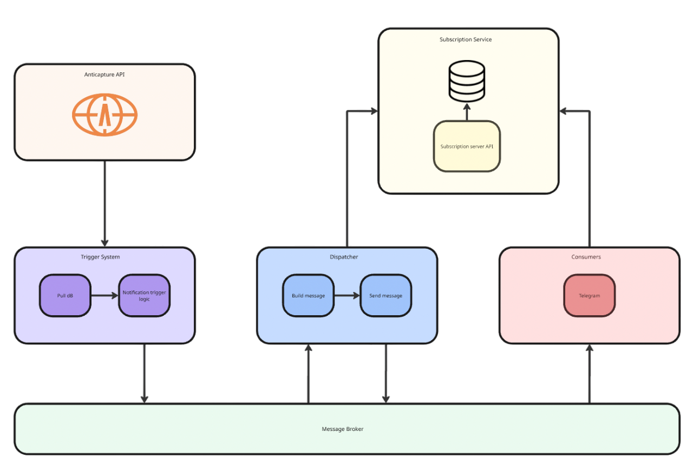

# Anticapture Notification System

**Event-driven notification system** for DAO governance with real-time proposal monitoring and multi-channel delivery. Built with microservices architecture and RabbitMQ message queues.

## 🏗️ System Architecture

The system consists of four main microservices that work together to provide scalable, reliable notification delivery:



## 🎯 Core Services

### 1. [Logic System](./apps/logic-system/README.md)
**Trigger Engine** - Monitors blockchain data and initiates notifications

- **Data Monitoring**: Polls AntiCapture GraphQL API for new proposals
- **Business Logic**: Applies filtering rules based on proposal status
- **Technologies**: Node.js, TypeScript, GraphQL, RabbitMQ

### 2. [Dispatcher](./apps/dispatcher/README.md)
**Message Orchestrator** - Processes events and coordinates notification delivery

- **Event Routing**: Routes trigger events to appropriate handlers
- **Subscription Management**: Fetches subscriber lists with temporal filtering
- **Notification Creation**: Builds formatted notifications for each user

### 3. [Subscription Server](./apps/subscription-server/README.md)
**API Gateway** - Manages user preferences and subscription data

- **REST API**: Subscription CRUD operations with Swagger documentation
- **Deduplication**: Prevents duplicate notifications via tracking
- **User Management**: Multi-channel user profiles and preferences

### 4. [Consumer Service](./apps/consumers/README.md)
**Delivery Layer** - Handles notification delivery and user interactions

- **Telegram Bot**: Interactive bot for preference management
- **Message Delivery**: RabbitMQ consumer for notification distribution

## 🚀 Quick Start

### Prerequisites
- **Node.js** 18+ with pnpm
- **Docker** and Docker Compose
- **PostgreSQL** database
- **RabbitMQ** message broker
- **Telegram Bot Token** (from [@BotFather](https://t.me/botfather))

### Development Setup

1. **Clone and Install**
```bash
git clone <repository-url>
cd notificationSystem
pnpm install
```

2. **Environment Configuration**
```bash
cp env.example .env
# Edit .env with your configuration
```

3. **Start Services**
```bash
# Start all services with Docker Compose
pnpm dev
```

## 📊 Data Flow

### Notification Pipeline
```
1. Logic System polls AntiCapture API for new proposals
2. Logic System sends trigger events to Dispatcher via RabbitMQ
3. Dispatcher processes events and fetches DAO subscribers
4. Dispatcher creates individual notifications and publishes to Consumer queue
5. Consumer delivers notifications to users via Telegram
6. Consumer tracks successful deliveries in Subscription Server
```

### User Interaction Flow
```
1. User interacts with Telegram bot (/start, /daos)
2. Consumer fetches available DAOs from AntiCapture API
3. Consumer presents interactive selection interface
4. User selections are sent to Subscription Server
5. Preferences are stored in PostgreSQL database
6. Future notifications are filtered by these preferences
```

## 🔍 Key Features

### Reliability
- **Deduplication**: Prevents duplicate notifications via tracking
- **Temporal Filtering**: Only notifies users subscribed before events
- **Session Management**: Persistent user state during interactions

### Extensibility
- **Trigger System**: Easy to add new event types and business logic
- **Multi-Channel**: Framework for adding Discord, Slack, etc.

## 🛠️ Development

### Project Structure
```
notificationSystem/
├── apps/
│   ├── logic-system/         # Event monitoring and triggering
│   ├── dispatcher/           # Message processing and routing
│   ├── subscription-server/  # User preference management
│   ├── consumers/           # Notification delivery (Telegram)
│   └── integrated-tests/    # End-to-end testing
├── packages/
│   ├── anticapture-client/  # GraphQL client for DAO data
│   └── rabbitmq-client/     # Shared RabbitMQ utilities
├── docker-compose.yml       # Multi-service orchestration
└── pnpm-workspace.yaml     # Monorepo configuration
```

## 📚 Documentation

### Service-Specific Guides
- [Logic System Documentation](./apps/logic-system/README.md) - Trigger engine and monitoring
- [Dispatcher Documentation](./apps/dispatcher/README.md) - Message processing hub
- [Subscription Server Documentation](./apps/subscription-server/README.md) - REST API and preferences
- [Consumer Documentation](./apps/consumers/README.md) - Telegram bot and delivery

### Extension Guides
- [Adding New Trigger Types](./docs/guides/add-trigger-logic.md) - Extend monitoring capabilities
- [Adding New Consumer Channels](./docs/guides/add-consumer-channel.md) - Support Discord, Slack, etc.